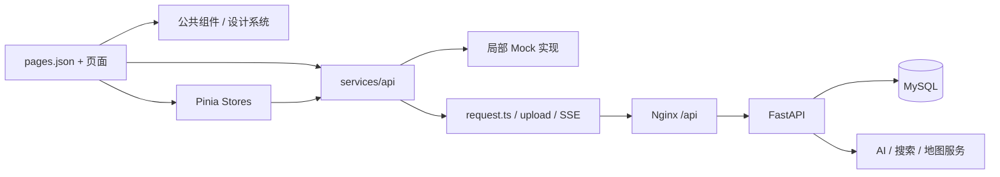

# 日迹（Avalin）前端

<p align="center">
  
</p>

<p align="center">
  <strong>记录生活 · AI 创作 · 精准社交 · 助力成长</strong>
</p>

日迹是一款面向大学生的 AI 生活伙伴应用。前端基于 UniApp、Vue 3、TypeScript 与 Vite，覆盖 H5、App 和多种小程序构建目标。

[后端仓库](https://github.com/Qyjay/riji-backend) · [接口规范](API-SPEC.md) · [设计说明](docs/DESIGN.md)


## 核心功能

| 模块 | 能力 |
|---|---|
| AI 日记 | 文字、图片、语音和对话素材，日记生成、编辑、点评与情绪趋势 |
| 衍生创作 | 漫画、小说章节、分享卡片和自定义文风 |
| AI 对话 | 多模型选择、多模态附件、流式回复、会话管理和联网搜索 |
| 校园广场 | 帖子、搜索、评论、点赞、评论收件箱和分身推荐 |
| AI 分身 | 记忆、侧写、名片、自动冲浪、行动审批和 A2A 匹配 |
| 社交 | 用户画像、兴趣匹配、搭子申请、消息和匹配报告 |
| 成长 | 成就、学期报告、每日运势、纪念日、番茄钟和待办 |
| 我的小传 | 基于日记、素材与记忆生成自传目录和章节 |

当前代码规模：

- 35 个页面
- 13 个公共组件
- 14 个真实 API 模块
- 10 个 Mock 数据模块
- 6 个 Pinia/存储模块

## 架构



### 分层说明

| 路径 | 职责 |
|---|---|
| `src/pages/` | 页面与页面级交互；路由集中在 `src/pages.json` |
| `src/components/` | 导航栏、TabBar、日记卡片、Markdown 和聊天组件 |
| `src/stores/` | 用户、日记、聊天、设置等状态与跨端持久化 |
| `src/services/api/` | 真实后端接口、类型定义和少量流式/上传适配 |
| `src/services/mock/` | 离线演示数据；当前只覆盖主要模块，并非所有新功能 |
| `src/services/request.ts` | API 地址拼接、JWT 注入、统一响应解析和 401 跳转 |
| `src/common/` | 设计 Token、动画与手绘风格样式 |
| `src/static/` | Logo、字体、图标与插图 |

### 请求链路

1. 页面或 Store 调用 `src/services/api/*`。
2. API 模块根据 `USE_MOCK` 决定调用 Mock 或真实接口。
3. `request.ts` 从 `uni` 存储读取 `token`，注入 `Authorization: Bearer ...`。
4. 后端统一响应 `{ code, data, message }` 被解包；401 会清理登录状态并重启到登录页。
5. 上传、SSE 和 WebSocket 场景在对应 API 模块中单独处理。

## 快速开始

### 环境要求

- Node.js 18+，推荐 Node.js 20 LTS
- npm 9/10
- Git
- HBuilderX 4+（仅 App 云打包需要）

### 安装与运行

```bash
git clone https://github.com/Qyjay/riji-frontend.git
cd riji-frontend

# 当前锁文件与 Pinia/Vue peer 约束在新版 npm 下需要此参数
npm ci --legacy-peer-deps

npm run dev:h5
```

H5 开发地址通常为 `http://localhost:5173/`。

### 连接本地后端

当前默认 API 地址定义在 `src/services/config.ts`：

```ts
const DEFAULT_API_BASE_URL = 'http://115.190.218.167/api'
```

本地联调时，将它改为：

```ts
const DEFAULT_API_BASE_URL = 'http://127.0.0.1:8000/api'
```

然后启动后端：

```bash
uvicorn app.main:app --reload --host 127.0.0.1 --port 8000
```

### Mock 模式

```bash
VITE_USE_MOCK=true npm run dev:h5
```

Mock 分支位于各 `src/services/api/*` 函数内部。素材、日记、AI、聊天、用户、社交、纪念日、广场、分身和学习模块有主要 Mock 覆盖；记忆、位置和小传等新增模块仍需要真实后端。

## 常用命令

```bash
npm run dev:h5
npm run build:h5
npm run dev:mp-weixin
npm run build:mp-weixin
npm run type-check
npm test
```

H5 生产产物位于 `dist/build/h5/`。

## 页面与模块

```text
src/
├── pages/
│   ├── login/                 # 登录注册
│   ├── index/                 # 首页
│   ├── write/                 # 快速记录、素材与润色
│   ├── diary/                 # 日记、点评、情绪、漫画与分享
│   ├── chat/                  # AI 对话
│   ├── discover/ plaza/       # 发现与校园广场
│   ├── social/ messages/      # 社交匹配与消息
│   ├── profile/               # 资料、设置、画像、分身与报告
│   ├── growth/ study/         # 成长、成就、番茄钟和待办
│   ├── anniversary/ fortune/  # 纪念日与运势
│   ├── novel/                 # 我的小传
│   └── search/ settings/      # 搜索与关于
├── components/
│   ├── chat/                  # 聊天子组件
│   ├── CustomNavBar.vue
│   ├── TabBar.vue
│   ├── DiaryCard.vue
│   └── MarkdownRenderer.vue
├── services/
│   ├── api/
│   ├── mock/
│   ├── config.ts
│   ├── request.ts
│   └── index.ts
├── stores/
├── common/
├── static/
├── pages.json
└── manifest.json
```

所有页面在 `src/pages.json` 注册，并使用自定义导航栏。新增页面时需要同时注册路由，并优先复用现有导航、TabBar、设计 Token 和聊天组件。

## 设计系统

视觉风格为温暖、低压力的 Doodle 手绘风：

| Token | 值 | 用途 |
|---|---|---|
| Primary | `#E8855A` | 暖杏橙主色 |
| Background | `#FDF8F3` | 奶油白背景 |
| Text | `#4A3628` | 暖棕正文 |
| Accent | `#F2B49B` | 淡珊瑚强调 |

跨端页面主要使用 `rpx`；边框和阴影可使用 `px`。公共样式位于 `src/common/`，全局变量与字体位于 `src/App.vue`。

## 生产部署

当前后端服务器：`115.190.218.167`。

```bash
npm ci --legacy-peer-deps
npm run build:h5
```

将 `dist/build/h5/` 内容复制到后端仓库的 `deploy/frontend/`，再由后端仓库的 Docker Compose 启动 Nginx、FastAPI 与 MySQL。

生产请求应优先使用 HTTPS 或同源 `/api`。当前默认地址是 `http://115.190.218.167/api`；如果 H5 页面通过 HTTPS 提供，浏览器会阻止该 HTTP API 的混合内容请求。正式发布前应将默认 API 地址调整为 HTTPS 地址或实现构建环境注入。

## 质量检查

```bash
npm test
npm run type-check
npm run build:h5
```

注意：

- `npm ci` 在 npm 11 下会因当前 Vue 3.4 与 Pinia 2.3 的 peer 约束失败，使用 `--legacy-peer-deps` 可复现安装。
- `npm audit` 当前会报告来自 UniApp 工具链及其传递依赖的漏洞；升级前需先验证多平台构建兼容性。
- App 权限声明集中在 `src/manifest.json`，上架前应按实际功能做最小权限复核。
- Mock 与真实接口应保持同一返回结构，新增后端模块时同步补齐前端类型和 Mock 策略。

## License

[MIT](LICENSE)
