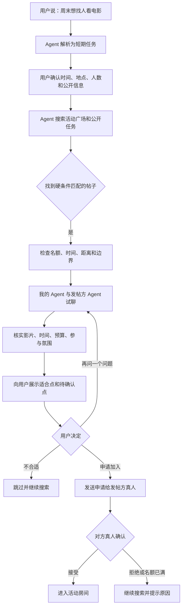
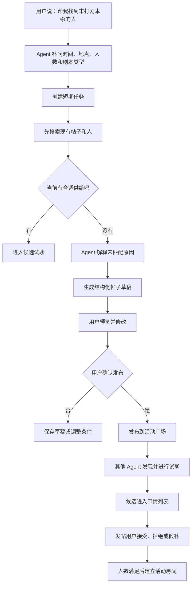
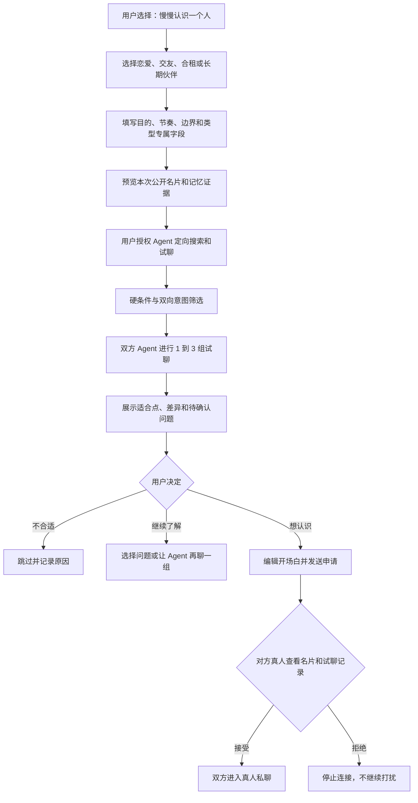
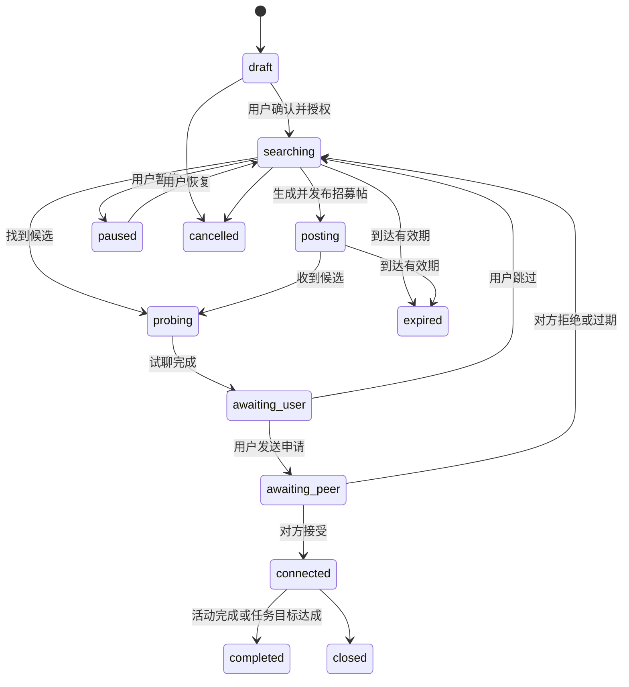

# Avalin Agent-to-Agent 找朋友完整交互设计

> 版本：v1.0
> 日期：2026-08-10
> 范围：短期搭子、长期关系、活动广场、AtoA 试聊、双向确认、真人接管
> 核心原则：AI 负责找人和试聊，真人负责判断和承诺

---

## 0. 方案摘要

Avalin 的“找朋友”不应只是一个推荐列表，也不应把所有需求都压缩成“匹配度”。它应是一套由用户目的驱动的 Agent-to-Agent 社交系统：

1. 用户先表达“我为什么想找人”。
2. Agent 将自然语言整理成一份可编辑的找人任务。
3. 短期任务优先匹配活动、时间、地点和名额，长期任务优先匹配关系意图、生活方式和边界。
4. Agent 先搜索现有帖子和公开名片，再与对方 Agent 进行低风险试聊。
5. 没有合适供给时，Agent 生成招募帖草稿，用户确认后再发布。
6. Agent 可以筛选、询问和总结，但不能替用户申请加入、接受关系、交换联系方式、支付或作出承诺。
7. 双方真人确认后，短期任务进入“活动房间”，长期任务进入真人私聊。

### 0.1 对用户的产品命名

一级入口建议命名为 **找朋友**，而不是直接使用偏技术化的“AtoA”。

| 内部分类 | 用户看到的名称 | 用户心智 |
|---|---|---|
| `short_term` | 一起做件事 | 周末看电影、剧本杀、吃饭、运动、临时组队 |
| `long_term` | 慢慢认识一个人 | 恋爱、交友、合租、长期学习或运动伙伴 |

“AtoA 试聊”作为能力说明出现，不作为用户必须理解的一级导航。

### 0.2 产品中的三类对象

| 对象 | 作用 | 示例 |
|---|---|---|
| 找人任务 `SocialMission` | 表达“我想找谁、为什么、什么时候找” | 本周六找人看电影 |
| 广场机会 `OpportunityPost` | 对所有符合可见范围的人公开招募 | 周六 19:30 电影，还差 1 人 |
| 候选连接 `MissionCandidate` | Agent 搜索、试聊后形成的具体候选 | 某帖子、某位用户、某个活动小组 |

用户管理的是“任务”，不是一堆互不关联的推荐卡片。

---

## 1. 设计目标

### 1.1 用户目标

- 用户可以直接说一句话发起找人，不需要先理解复杂分类。
- 用户可以查看并修改 Agent 理解出的目的、条件和边界。
- 用户知道 Agent 使用了哪些信息、做了哪些事、下一步需要谁决定。
- 短期需求能快速找到可参加的具体活动。
- 长期需求能先低压力了解，再决定是否真人接触。
- 找不到人时，Agent 可以帮助生成高质量招募帖。
- 用户随时可以暂停、修改、关闭任务或撤销 Agent 权限。

### 1.2 产品目标

- 建立“记忆生长 -> 意图形成 -> Agent 找人 -> AtoA 试聊 -> 真人确认”的闭环。
- 让广场帖子成为 Agent 可理解、可检索、可撮合的结构化供给。
- 将当前全局冲浪升级为“任务范围内的定向探路”。
- 通过履约结果和用户反馈改善推荐，不以聊天时长作为唯一成功指标。

### 1.3 不做什么

- 不做无限刷人的陌生人卡片流。
- 不让单一匹配分数替代用户判断。
- 不默认公开日记、聊天原文、精确位置或联系方式。
- 不让 Agent 自动发布、报名、接受关系或作出线下承诺。
- 不把恋爱、交友、合租和临时活动使用同一套表单与排序逻辑。

---

## 2. 双模式定义

### 2.1 短期搭子：一起做件事

短期任务以一次活动或有限周期内的共同目标为中心。

### 核心字段

- 活动：看电影、剧本杀、吃饭、运动、展览、旅行、自习、游戏、其他。
- 时间：开始时间、结束时间、可浮动范围、报名截止时间。
- 地点：大致区域、距离范围，确认前默认不展示精确位置。
- 人数：需要几人、当前已有几人、是否接受候补。
- 预算：免费、AA、大致区间、由谁预订。
- 要求：技能、经验、学校、年龄范围、参与边界。
- 氛围：安静、轻松、重度玩家、第一次尝试也可以。
- 联系节奏：立即确认、当天内回复、先由 Agent 问清楚。
- 任务有效期：默认在活动开始前自动过期。

### 匹配优先级

1. 时间是否重叠。
2. 地点和距离是否可接受。
3. 名额是否仍有效。
4. 活动类型和具体内容是否一致。
5. 预算、技能和明确边界是否满足。
6. 社交氛围和沟通偏好是否相容。

短期任务不应因为“人格相似度不够高”而压过一个时间地点完全合适的活动。

### 2.2 长期搭子：慢慢认识一个人

长期任务以持续关系为中心，不要求立即约定某个活动。

### 关系类型

- 恋爱。
- 交朋友。
- 合租。
- 长期学习伙伴。
- 长期运动伙伴。
- 长期兴趣伙伴。

### 通用字段

- 关系目的：想建立什么关系，不接受什么关系。
- 期待节奏：先线上聊、先参加共同活动、尽快线下见面。
- 地域范围：同校、同城、可异地。
- 可投入时间：常见空闲时段、联系频率。
- 沟通风格：主动或慢热、文字或语音、深聊或轻松。
- 共同兴趣与长期目标。
- 必须满足项、加分项、明确边界。
- 对外公开名片和本次可用记忆。

### 类型专属字段

| 类型 | 补充字段 |
|---|---|
| 恋爱 | 年龄范围、性别偏好、关系期待、是否接受异地、见面节奏 |
| 交友 | 希望一起做的事、联系频率、社交能量、偏好一对一或小群体 |
| 合租 | 预算、区域、入住时间、租期、作息、卫生、宠物、做饭、访客边界 |
| 长期学习 | 目标、周期、当前水平、监督方式、固定时间 |
| 长期运动 | 项目、水平、频率、场地、强度、伤病边界 |

### 匹配优先级

1. 双方关系意图是否一致。
2. 必须满足项和明确边界是否冲突。
3. 生活方式与可投入时间是否兼容。
4. 共同兴趣、目标和沟通方式是否适合。
5. 双方 Agent 试聊后是否仍认为值得真人了解。

长期任务使用“适合点 + 待确认点 + 证据”表达，不向用户突出一个看似精确的百分比分数。

---

## 3. 总体信息架构

### 3.1 底部导航

保留当前社交 Tab 的位置，将页面名称从“分身”调整为“找朋友”或“遇见”。

```text
首页 | 找朋友 | 记录 | 消息 | 我的
```

### 3.2 找朋友首页分区

```text
找朋友
├── 发起找人
│   ├── 一起做件事
│   └── 慢慢认识一个人
├── 正在进行
│   ├── 搜索中的任务
│   ├── Agent 正在试聊
│   └── 等待双方确认
├── 等你决定
│   ├── 候选推荐
│   ├── AtoA 试聊结果
│   └── 收到的申请
├── 已连接
│   ├── 即将开始的活动
│   ├── 活动房间
│   └── 长期关系私聊
└── 广场
    ├── 活动招募
    ├── 长期寻友
    └── 分享与求助
```

### 3.3 页面路由建议

| 页面 | 建议路由 | 处理方式 |
|---|---|---|
| 找朋友首页 | `pages/social/index` | 重构现有页 |
| 发起找人 | `pages/social/find` | 新增 |
| 短期任务编辑 | `pages/social/mission-short` | 新增 |
| 长期任务编辑 | `pages/social/mission-long` | 新增 |
| 授权与公开预览 | `pages/social/mission-permission` | 新增 |
| 任务详情 | `pages/social/mission-detail` | 新增 |
| 候选列表 | `pages/social/candidates` | 新增 |
| AtoA 试聊详情 | `pages/social/atoa-detail` | 扩展现有页 |
| 申请与确认 | `pages/social/request-status` | 扩展现有页 |
| 活动房间 | `pages/social/activity-room` | 新增 |
| 真人聊天 | `pages/social/chat` | 复用现有页 |
| 活动广场 | `pages/discover/index` | 重构现有页 |
| 结构化发帖 | `pages/plaza/post` | 重构现有页 |
| 帖子详情 | `pages/plaza/detail` | 扩展现有页 |
| 分身名片与权限 | `pages/profile/avatar-memory` | 扩展现有页 |

---

## 4. 统一入口与意图识别

### 4.1 找朋友首页

### 页面目标

让用户在 3 秒内完成两件事：

1. 知道当前有哪些找人任务在推进。
2. 能立即说出一个新的找人目的。

### 页面结构

```text
┌──────────────────────────────────┐
│ 找朋友                    广场    │
├──────────────────────────────────┤
│ 你现在想找什么样的人？            │
│ [告诉分身，例如：周末想找人看电影] │
│ [一起做件事]  [慢慢认识一个人]     │
├──────────────────────────────────┤
│ 正在进行 2                        │
│ 周六看电影       找到 1 个合适活动 │
│ 找合租室友       Agent 试聊中      │
├──────────────────────────────────┤
│ 等你决定 3                        │
│ 陈同学：时间地点都合适             │
│ 林同学：有 2 个问题需要确认         │
├──────────────────────────────────┤
│ 即将开始                          │
│ 周六 19:30 电影      查看活动房间  │
└──────────────────────────────────┘
```

### 功能

- 自然语言输入。
- 语音输入。
- 两个快捷模式入口。
- 最近目的快捷复用。
- Agent 从日记中识别到社交需求时，只显示建议，不自动创建任务。
- 任务状态摘要。
- 待决定数量。
- 即将开始活动。
- 收到的申请。
- 广场入口。
- 分身权限和公开名片入口。

### 4.2 自然语言解析

用户输入：

> 想找一个周末一起出去玩的人，最好能一起看电影。

Agent 输出可编辑确认页：

```text
我理解的是：

模式：一起做件事
活动：看电影
时间：本周末，具体时间可商量
地点：你附近 5 km
人数：1 人
偏好：也愿意一起逛逛或吃饭
有效期：本周日 23:59

还需要你确认：
1. 想看哪部电影？
2. 是否只看本校的人？
```

### 解析规则

- 有明确活动、日期、地点、名额时，优先判断为短期。
- 出现恋爱、交友、室友、长期、固定、以后经常时，优先判断为长期。
- 同时包含长期关系和一次活动时，先询问主目的。
- 缺少关键硬条件时，最多追问 1 到 3 个问题。
- Agent 必须展示“已推断”和“待确认”，不能把推断伪装成用户输入。
- 用户可以一键切换模式，切换后保留可复用字段。

### 4.3 发起方式

| 入口 | 示例 | 后续 |
|---|---|---|
| 直接告诉 Agent | “周六想找人看电影” | 解析并确认任务 |
| 选择模式后填写 | 点击“一起做件事” | 进入引导表单 |
| 从广场帖子发起 | 帖子详情点“让分身帮我问问” | 以该帖子创建定向任务 |
| 从日记建议发起 | 日记中提到“最近想找室友” | 用户确认后创建任务 |
| 从历史任务复用 | 再找一次羽毛球搭子 | 复制后修改时间 |
| 让 Agent 发帖 | “帮我发个剧本杀招募” | 生成任务和帖子草稿 |

---

## 5. 核心链路一：已有电影帖子，Agent 建联并推荐

### 5.1 用户路径



### 5.2 Agent 试聊内容

试聊只围绕任务所需事实，不模拟真人情感承诺。

```text
我的 Agent：
我的用户本周六下午或晚上有空，想看《F1：狂飙飞车》。你们还有名额吗？

对方 Agent：
还有 1 个名额，计划周六 19:30 在大悦城，票价约 45 元，结束后可能一起吃饭。

我的 Agent：
我的用户距离可以接受。想确认一下，这次是熟人局还是大家都第一次见？

对方 Agent：
目前 3 人，其中 2 人认识，发帖人已开启“欢迎新朋友”。
```

### 5.3 推荐结果不只显示匹配度

推荐页应优先展示：

- 活动：周六 19:30 看《F1：狂飙飞车》。
- 距离：约 2.4 km。
- 名额：还差 1 人。
- 预算：约 45 元，默认 AA。
- 适合点：时间完全重叠、想看的影片相同、接受新朋友。
- 待确认：散场后是否参加聚餐。
- 信息证据：来自公开帖子、对方公开活动偏好、AtoA 本轮回答。
- 风险提示：活动地点确认前仅显示商圈。

底部操作：

```text
[不合适] [让分身再问] [申请加入]
```

---

## 6. 核心链路二：没有剧本杀帖子，Agent 代拟招募

### 6.1 用户路径



### 6.2 帖子草稿

```text
周六下午想组一局新手友好的剧本杀

时间：8 月 15 日 14:00 到 18:00
地点：南开大学附近 5 km
类型：欢乐本或轻推理，不玩重恐
人数：已有 2 人，还差 3 人
预算：人均 80 到 120 元，AA
希望：守时、尊重其他玩家，新手也欢迎
报名截止：周五 20:00

由我的分身协助整理，发布前已由本人确认。
```

### 6.3 发布前确认

必须逐项展示：

- 公开给谁看。
- 是否显示学校。
- 地点精度。
- 哪些条件来自用户原话。
- 哪些内容由 Agent 推断。
- 是否允许其他 Agent 自动询问。
- 是否允许 Agent 生成回复草稿。
- 帖子过期时间。

发布按钮文案使用“确认并发布”，不使用“让 Agent 全权处理”。

### 6.4 招募管理

发帖人可以：

- 查看申请人列表。
- 查看每位候选的硬条件匹配情况。
- 查看 AtoA 试聊摘要和完整记录。
- 接受、拒绝、加入候补。
- 修改活动时间、人数、预算。
- 提前停止招募。
- 名额满后自动将帖子标记为“已组满”。
- 候选退出后从候补顺序补位，但必须由发帖人确认。

---

## 7. 核心链路三：长期恋爱、交友或合租

### 7.1 用户路径



### 7.2 长期任务创建页

表单采用渐进式展开，不在首屏一次展示所有字段。

#### 第一步：关系目的

```text
这次想建立什么关系？

( ) 恋爱
( ) 交朋友
( ) 找室友
( ) 长期学习伙伴
( ) 长期运动伙伴
( ) 其他长期伙伴
```

#### 第二步：一句话描述

```text
我想找一个能周末一起探索城市，
平时也愿意分享生活的人。
```

#### 第三步：必须满足与明确边界

- “必须满足”最多 5 条，防止把长期关系变成无限筛选器。
- “加分项”最多 8 条。
- “不能接受”必须明确显示给 Agent，但可选择是否对候选公开。
- 敏感字段逐项授权，不默认从长期记忆自动带入。

#### 第四步：本次公开名片

分为三层：

| 层级 | 内容 | 默认 |
|---|---|---|
| 公开摘要 | 昵称、模糊年龄段、学校或城市、兴趣、关系目的 | 开启 |
| 匹配专用 | 作息、沟通风格、长期目标、边界 | 用户逐项选择 |
| 始终私密 | 日记原文、私聊原文、精确住址、联系方式 | 禁止 Agent 公开 |

### 7.3 长期候选结果

不以“92% 契合”作为主信息，改为：

```text
值得了解

适合点
1. 都希望先从共同活动开始，不急于确认关系
2. 周末时间和联系频率接近
3. 都喜欢摄影和城市漫步

待确认
1. 对方能接受异地，但你尚未表态
2. 对方偏语音沟通，你更常用文字

双方 Agent 已聊 2 组
使用信息：本次公开名片 7 项

[不合适] [再聊一组] [想认识 TA]
```

### 7.4 合租的特殊规则

合租虽然属于长期任务，但匹配时硬条件优先：

- 入住时间。
- 租期。
- 预算。
- 地理区域。
- 性别和合住边界。
- 宠物、吸烟、作息、卫生和访客规则。

只有硬条件满足后，才进入生活方式试聊。Agent 不参与定金、合同、转账或身份文件交换。

---

## 8. 核心链路四：被动收到其他 Agent 的连接

Agent-to-Agent 必须支持双向透明。

### 8.1 对方 Agent 可以何时联系我的 Agent

需要同时满足：

1. 用户已开启“允许我的分身回应相关试聊”。
2. 对方任务与我的公开意图相关。
3. 双方可见范围和硬边界不冲突。
4. 对方未被我屏蔽或举报。
5. 单日被动试聊次数未超过上限。

### 8.2 低打扰策略

- 初次 AtoA 探针不立即打扰真人。
- 所有探针进入“分身活动记录”，用户随时可看。
- 对方真人发出连接申请后，才进入“等你决定”的高优先级通知。
- 收到申请时，用户能看到自己的 Agent 代表自己说过什么。
- 用户可以接受、拒绝、屏蔽或举报。

### 8.3 收到申请页面

展示：

- 对方是谁及公开名片。
- 对方为什么联系我。
- 双方 Agent 完整试聊记录。
- 我的 Agent 使用了哪些授权信息。
- 对方想建立的关系或参加的活动。
- 需要我承担的时间、预算或其他条件。
- 风险提示和共同联系人状态。

操作：

```text
[拒绝] [屏蔽或举报] [接受并开始真人交流]
```

拒绝时可以选择私密原因，用于个人推荐调整，不发送给对方。

---

## 9. 页面级交互规格

### 9.1 发起找人页

### 页面元素

- 大文本输入框。
- 语音按钮。
- 模式快捷选择。
- 场景示例。
- 历史任务。
- “从我的记忆中给建议”开关，默认关闭。

### 示例文案

```text
告诉分身，你为什么想找人

例如：
周末想找一个人看电影
帮我组一个新手剧本杀局
想认识能长期一起学习的人
下个月想找作息相近的室友
```

### 提交状态

- 空输入：按钮禁用。
- 解析中：展示逐项形成的字段骨架，不使用全屏旋转加载。
- 解析失败：保留原文并提供“手动填写”。
- 网络中断：本地保存草稿。

### 9.2 短期任务编辑页

### 信息顺序

1. 做什么。
2. 什么时候。
3. 在哪里。
4. 还需要几人。
5. 预算和预订。
6. 必须满足与活动氛围。
7. 搜索策略。
8. 公开与 Agent 权限。

### 搜索策略

```text
分身怎么帮你找？

(*) 先找现有活动，没有合适的再生成帖子草稿
( ) 只找现有活动
( ) 直接生成招募帖草稿
```

推荐默认选择第一项。

### 9.3 长期任务编辑页

### 信息顺序

1. 关系类型。
2. 目的描述。
3. 希望的相处方式。
4. 必须满足、加分项和不能接受。
5. 类型专属条件。
6. 本次公开名片。
7. 搜索频率和通知节奏。
8. Agent 权限。

### 任务有效期

- 恋爱或交友：默认持续 30 天，可暂停。
- 合租：默认到入住日期前 7 天。
- 长期学习或运动：默认 30 天，可续期。

### 9.4 授权与公开预览页

这是创建任务前的强制步骤。

```text
这次分身会做什么

[允许] 搜索符合条件的公开帖子和名片
[允许] 与符合条件的 Agent 进行最多 3 组试聊
[允许] 生成回复或招募帖草稿
[不允许] 未经确认直接发布帖子
[不允许] 未经确认发送加入或认识申请
[禁止] 分享联系方式、精确位置、日记原文

本次会使用
✓ “喜欢科幻电影”  来自 8 月 2 日日记摘要
✓ “周末通常有空”  由你手动填写
✓ “偏好小群体活动”  来自分身名片

[返回修改] [确认并开始寻找]
```

功能：

- 逐条取消某条记忆。
- 查看记忆来源。
- 编辑公开表达。
- 切换地点精度。
- 设置 AtoA 最大轮数。
- 设置每日通知上限。

### 9.5 任务详情页

任务详情是一次找人行为的控制中心。

### 页面区块

- 任务标题与模式。
- 当前状态。
- 关键条件摘要。
- Agent 最新进展。
- 候选漏斗。
- 广场帖子状态。
- 等待用户决策项。
- 权限与使用信息。
- 修改、暂停、关闭。

### 短期状态示例

```text
周六看电影
搜索中，距离活动开始还有 3 天

已扫描 16 个帖子
硬条件符合 3 个
Agent 已试聊 2 个
等你决定 1 个

[查看候选]
```

### 长期状态示例

```text
找长期摄影朋友
第 8 天

公开名片被 6 位相关用户的 Agent 读取
双方意图匹配 3 位
试聊完成 2 位
等你决定 2 位
```

### 任务操作

- 编辑条件。
- 暂停搜索。
- 恢复搜索。
- 扩大范围。
- 降低某个非必要条件。
- 生成或更新招募帖。
- 关闭任务。
- 删除任务及关联数据。

修改硬条件后，正在进行的候选必须重新校验。

### 9.6 候选列表

### 短期排序

- “完全满足硬条件”优先。
- 即将截止的活动置顶，但不压过安全和边界冲突。
- 每项显示时间、距离、名额和一个待确认问题。

### 长期排序

- 先显示双向意图一致且无边界冲突的人。
- 不展示公开排名编号。
- 不把内部模型分数直接展示为人格价值。
- 每项显示适合点数量和待确认问题数量。

### 筛选

- 全部。
- 等你决定。
- Agent 试聊中。
- 已申请。
- 已跳过。
- 有风险提示。

### 9.7 AtoA 试聊详情页

扩展现有 `pages/social/atoa-detail.vue`。

### 顶部

- 候选身份摘要。
- 关联任务。
- 来源：广场帖子、公开名片或历史活动。
- 当前状态。

### 为什么找到对方

- 硬条件。
- 适合点。
- 待确认点。
- 风险或不确定项。
- 信息来源。

### 对话区

- 清楚标记“我的分身”和“对方分身”。
- 每组对话标记目标，例如“确认时间”“了解相处节奏”。
- 可展开查看本轮使用了哪些公开字段。
- 不展示模型思考过程。

### 底部动作

短期：

```text
[不合适] [再问一个问题] [申请加入]
```

长期：

```text
[不合适] [再聊一组] [想认识 TA]
```

“再问一个问题”支持：

- 从建议问题中选择。
- 用户手动输入问题。
- 让 Agent 自行选择最重要的未确认项。

### 9.8 广场首页

广场保留内容社区属性，但找人供给需要结构化。

### 一级切换

```text
[活动招募] [长期寻友] [分享与求助]
```

### 活动招募筛选

- 今天、本周末、日期。
- 距离。
- 活动类型。
- 仍有名额。
- 预算。
- 新手友好。
- 同校。

### 长期寻友筛选

- 交友、恋爱、合租、学习、运动。
- 同校、同城。
- 最近活跃。
- 双方意图相容。

### 帖子列表的关键变化

- 活动时间和名额必须在正文之外独立展示。
- 已组满、已结束、已取消有明确状态。
- Agent 代拟内容标记“分身协助整理，用户已确认”。
- 将当前“私聊 Ta”改为“让分身帮我问问”或“申请加入”。
- 推荐内容与普通帖子在结构上区分，但不使用左侧粗彩条。

### 9.9 结构化发帖页

当前 `pages/plaza/post.vue` 只支持类型、正文、图片、位置和标签，需要升级。

### 活动招募

- 活动类型。
- 标题和补充说明。
- 日期和时段。
- 地点及展示精度。
- 已有人数和目标人数。
- 预算。
- 报名截止。
- 参与要求。
- 是否接受候补。
- 是否允许其他 Agent 自动询问。
- 是否允许我的 Agent 生成回复草稿。

### 长期寻友

- 关系类型。
- 目的说明。
- 地域范围。
- 期待节奏。
- 公开名片字段。
- 有效期。
- 是否允许 AtoA 探针。

### 9.10 帖子详情页

### 活动帖

- 活动事实区。
- 组织者公开信息和可信状态。
- 当前名额。
- 参加者构成摘要，需保护隐私。
- 报名截止。
- 参与要求。
- AtoA 问答。
- 评论。

底部：

```text
[收藏] [让分身帮我问问] [申请加入]
```

### 长期寻友帖

- 关系目的。
- 公开名片。
- 希望的相处方式。
- 明确边界。
- AtoA 探针入口。

不直接展示联系方式。

### 9.11 申请与确认页

按上下文显示两种列表：

- 我发出的申请。
- 我收到的申请。

状态：

- 等待对方。
- 等我决定。
- 已接受。
- 已拒绝。
- 已撤回。
- 已过期。
- 活动已满。

收到申请时不能只显示一句申请理由，必须提供任务条件、试聊记录、公开信息和风险提示。

### 9.12 活动房间

短期任务在双方确认后进入活动房间，不直接退化成普通私聊。

### 功能

- 活动名称、时间、地点和倒计时。
- 当前参与者和名额。
- 群聊或一对一聊天。
- 组织者公告。
- 地点确认与导航。
- 日历提醒。
- AA 和预算说明，不在 Avalin 内代付。
- 迟到、退出、取消活动。
- 候补补位。
- 活动结束确认。
- 安全入口。

### 地点策略

- 申请前：只显示商圈、校园或模糊距离。
- 双方确认后：由组织者选择是否共享具体店铺。
- 精确实时位置：始终需要真人主动分享，Agent 无权限。

### 9.13 真人聊天页

复用 `pages/social/chat.vue`，补充：

- 顶部关联任务或活动。
- 显示“现在由真人交流”。
- 一键查看匹配依据和 AtoA 记录。
- 屏蔽、举报、取消关系。
- 联系方式发送前安全提醒。
- 不让 Agent 继续以用户口吻自动发送消息。
- 可请求 Agent 给出回复建议，但发送动作必须由用户完成。

---

## 10. Agent-to-Agent 协作协议

### 10.1 AtoA 前置条件

- 双方均开启相关社交意图。
- 双方都授权公开名片参与匹配。
- 没有硬边界冲突。
- 没有屏蔽或高风险记录。
- 任务仍在有效期。
- 活动仍有名额。

### 10.2 AtoA 可讨论内容

### 短期

- 时间和可浮动范围。
- 地点和距离。
- 活动内容。
- 名额。
- 预算。
- 技能或经验要求。
- 新手友好程度。
- 活动氛围。

### 长期

- 关系目的。
- 认识节奏。
- 共同兴趣和长期目标。
- 常见空闲时间。
- 沟通风格。
- 已授权的生活方式与边界。

### 10.3 AtoA 禁止内容

- 日记或私聊原文。
- 精确住址、实时位置。
- 手机号、微信号、身份证件。
- 健康、财务等未单独授权的敏感信息。
- 替用户承诺参加、恋爱、合租或支付。
- 代替用户接受对方申请。
- 编造用户经历、感受或立场。

### 10.4 对话轮数

- 默认 1 组，每组双方各 1 到 2 次发言。
- 最多自动进行 3 组。
- 超过 3 组需要用户主动选择“再聊一组”。
- 每组必须有明确核验目标。
- 条件已足够判断时提前结束，不为展示 AI 能力而延长对话。

### 10.5 输出结构

```json
{
  "fit": [
    {
      "fact": "双方周六晚上都有空",
      "source": "mission_and_public_post",
      "confidence": "confirmed"
    }
  ],
  "questions": [
    {
      "question": "是否参加散场后的聚餐",
      "importance": "optional"
    }
  ],
  "conflicts": [],
  "riskFlags": [],
  "suggestedNextAction": "ask_user_to_apply"
}
```

---

## 11. Agent 权限模型

权限按任务设置，并提供全局上限。

### 11.1 四级能力

| 级别 | Agent 可以做什么 | 默认 |
|---|---|---|
| 观察 | 搜索公开帖子和名片 | 开启 |
| 探针 | 与已授权的对方 Agent 进行结构化试聊 | 开启 |
| 草拟 | 生成帖子、评论、回复和开场白草稿 | 开启 |
| 执行 | 公开发布、发送申请、接受关系、共享联系方式 | 关闭 |

“执行”不应成为一个笼统开关。以下动作始终需要当次真人确认：

- 发布公开帖子。
- 发送参加申请。
- 接受参加申请。
- 发送认识申请。
- 接受关系申请。
- 共享精确位置和联系方式。
- 确认活动、合租、恋爱或其他承诺。

### 11.2 权限矩阵

| 动作 | Agent 自动完成 | 需用户确认 | 永不允许 |
|---|---:|---:|---:|
| 搜索公开帖子 | 是 |  |  |
| 筛选公开名片 | 是 |  |  |
| 读取本次授权的结构化记忆 | 是 |  |  |
| 读取日记原文并对外发送 |  |  | 是 |
| AtoA 结构化试聊 | 任务内可授权 | 可关闭 |  |
| 生成招募帖草稿 | 是 |  |  |
| 发布招募帖 |  | 是 |  |
| 生成回复草稿 | 是 |  |  |
| 公开回复或私信 |  | 是 |  |
| 发送加入或认识申请 |  | 是 |  |
| 接受对方申请 |  | 是 |  |
| 交换联系方式 |  | 是 |  |
| 付款、签约、承诺关系 |  |  | 是 |

---

## 12. 状态机

### 12.1 找人任务状态



### 用户状态文案

| 内部状态 | 短期文案 | 长期文案 |
|---|---|---|
| `draft` | 还没开始寻找 | 还没开始寻找 |
| `searching` | 正在找合适活动 | 正在找值得了解的人 |
| `posting` | 招募中 | 公开寻友中 |
| `probing` | 分身正在问清楚 | 双方分身正在试聊 |
| `awaiting_user` | 有候选等你决定 | 有对话等你判断 |
| `awaiting_peer` | 等待对方确认参加 | 等待对方决定是否认识 |
| `connected` | 已组队 | 已连接 |
| `completed` | 活动已完成 | 已完成本次找人 |
| `paused` | 已暂停 | 已暂停 |
| `expired` | 活动已过期 | 任务已到期 |
| `cancelled` | 已取消 | 已关闭 |

### 12.2 候选状态

```text
discovered
-> checking_hard_constraints
-> agent_probing
-> ready_for_user
-> user_skipped
或
-> request_sent
-> peer_accepted
-> connected
```

其他终态：

- `peer_rejected`
- `slot_full`
- `candidate_expired`
- `risk_blocked`
- `user_blocked`

### 12.3 活动帖子状态

```text
draft -> published -> filling -> full -> confirmed -> completed
                     |          |
                     v          v
                  expired    cancelled
```

---

## 13. 匹配与排序逻辑

### 13.1 两阶段筛选

### 第一阶段：硬条件

不满足即不进入 AtoA：

- 时间无交集。
- 距离超出范围。
- 名额已满。
- 关系意图不一致。
- 必须满足项冲突。
- 对方未授权此类 AtoA。
- 已屏蔽或命中安全风险。

### 第二阶段：软适配

- 兴趣。
- 氛围。
- 沟通方式。
- 社交节奏。
- 生活方式。
- 活动经验。
- 历史履约偏好。

### 13.2 短期内部评分建议

```text
时间重叠      30
活动一致      20
地点距离      15
名额状态      15
预算与要求    10
氛围与偏好    10
```

内部评分用于排序，不直接作为人格价值展示。

### 13.3 长期内部评分建议

```text
关系意图一致       25
硬边界相容         25
生活节奏相容       15
共同兴趣与目标     15
沟通方式相容       10
AtoA 试聊结果      10
```

任一硬边界冲突时直接停止，不用其他高分抵消。

### 13.4 推荐解释

每条推荐必须包含：

- 至少 2 个具体适合点。
- 至少 1 个信息来源。
- 尚未确认的问题。
- 可能影响决定的差异。
- 风险标记。
- 下一步建议。

禁止只输出“你们都很有趣”“灵魂契合”等无法验证的空泛理由。

---

## 14. 通知系统

### 14.1 高优先级

- 收到参加或认识申请。
- 对方接受申请。
- 活动时间或地点变化。
- 活动即将开始。
- 活动取消。
- 安全或账号风险。

### 14.2 普通优先级

- Agent 完成一组试聊。
- 找到新的合格候选。
- 帖子收到新申请。
- 长期任务即将到期。

### 14.3 低优先级汇总

- Agent 今日扫描数量。
- 被动 AtoA 探针记录。
- 推荐条件优化建议。

默认每天最多发送一次低优先级汇总，避免用“Agent 很忙”制造通知噪声。

---

## 15. 异常、空状态与边界场景

| 场景 | 处理 |
|---|---|
| 没有任何匹配 | 解释卡在哪个硬条件，并建议扩大范围或发帖 |
| 时间即将过期 | 建议修改时间、扩大地点或直接发布 |
| 帖子名额刚满 | 标记“已满”，返回搜索并保留候补选项 |
| 对方撤销授权 | 立即停止试聊，删除未发送的草稿 |
| 用户修改硬条件 | 重新校验所有非终态候选 |
| Agent 理解错误 | 用户可直接修改字段，并提供“这不是我的意思”反馈 |
| AtoA 生成失败 | 保留候选事实，允许重试或用户直接查看帖子 |
| 网络中断 | 草稿本地保存，恢复后继续 |
| 重复候选 | 同一任务内合并，显示最新状态 |
| 同一用户多个帖子 | 按活动分别展示，不把不同活动错误合并 |
| 对方长时间不响应 | 到期后自动关闭申请并继续搜索 |
| 用户取消已确认活动 | 通知所有参与者并记录私密履约反馈 |
| 活动时间已过 | 自动归档并询问是否实际发生 |
| 用户退出长期任务 | 停止新推荐，不自动删除已建立的真人关系 |

### 15.1 没有结果时的正确文案

不使用：

> 暂时没有匹配，请稍后再试。

使用：

> 目前没有同时满足“本周六晚上、5 km 内、还差 1 人”的电影活动。你可以把范围扩大到 10 km，或让分身生成一条招募帖草稿。

---

## 16. 信任、安全与隐私

### 16.1 基础安全

- 恋爱功能仅向完成年龄确认的 18 岁以上用户开放。
- 默认推荐公开场所见面。
- 确认前使用模糊地点。
- 屏蔽双向生效。
- 举报后立即停止 Agent 互动。
- 防止同一用户频繁向大量用户发送申请。
- 对新账号、高拒绝率和高举报率进行限流。
- 活动组织者修改关键字段后，所有已申请用户重新确认。

### 16.2 数据最小化

- 匹配只读取本次任务和已授权的公开名片。
- 日记原文、AI 对话原文不进入 AtoA 上下文。
- 对外发送的是结构化摘要，不是原始证据。
- 每条公开信息都可查看来源并单独撤销。
- 任务关闭后停止继续使用任务快照。
- 用户可删除任务、帖子、探针记录和公开名片快照。

### 16.3 透明记录

每次 Agent 行动记录：

- 何时执行。
- 因为什么任务执行。
- 使用了哪些授权字段。
- 联系了哪个公开对象。
- 生成了什么内容。
- 是否对外可见。
- 是否经过用户确认。

### 16.4 安全入口

活动房间和真人聊天固定提供：

- 屏蔽。
- 举报。
- 退出活动。
- 联系可信联系人。
- 查看线下见面安全建议。

---

## 17. 视觉与交互语言

### 17.1 使用场景

大学生通常在宿舍、校园通勤或活动出发前使用手机，环境光较亮，注意力被频繁打断。因此采用暖色浅色主题、清晰状态和短路径操作，不使用持续发光或复杂动效。

### 17.2 色彩策略

使用克制的功能色：

- 主操作：暖杏橙 `#E8855A`。
- 短期活动提示：社交蓝 `#6B8EB4`。
- 长期关系提示：玫瑰粉 `#D4728A`。
- 成功与安全：森林绿 `#6BA87B`。
- 背景：奶油白 `#FDF8F3`。
- 正文：深暖棕 `#2C1F14`。

功能色用于状态和动作，不用大面积高饱和装饰。

### 17.3 布局

- 首页使用任务列表和状态分组，不做相同尺寸的卡片宫格。
- 候选列表以事实和下一步为主，头像不占据视觉中心。
- AtoA 详情使用对话时间线。
- 任务创建使用渐进式表单。
- 关键动作固定在底部，触控区域不小于 44px。
- 重要信息不只依赖颜色表达。

### 17.4 动效

- 状态切换 150 到 250ms。
- Agent 搜索显示真实阶段，例如“搜索帖子”“检查条件”“试聊中”。
- 支持减少动态效果。
- 不使用无意义的页面入场编排。

---

## 18. 完整功能清单

### 18.1 意图与任务

- 自然语言创建任务。
- 语音创建任务。
- 手动短期或长期创建。
- Agent 追问缺失字段。
- 意图确认与纠错。
- 草稿保存。
- 历史任务复制。
- 任务编辑、暂停、恢复、关闭、删除。
- 任务自动过期。
- 周期性任务复用。
- 从日记需求建议创建，但必须由用户确认。

### 18.2 搜索与候选

- 搜索公开帖子。
- 搜索公开分身名片。
- 硬条件筛选。
- 软适配排序。
- 去重。
- 候选状态跟踪。
- 适合点与待确认点。
- 风险标记。
- 用户跳过原因。
- 扩大范围建议。
- 候补补位。

### 18.3 AtoA

- 任务范围内定向试聊。
- 被动试聊授权。
- 每轮目标标记。
- 用户指定下一轮问题。
- 最大轮数限制。
- 完整透明记录。
- 试聊终止。
- 双向降权。
- 用户发起连接。
- 对方真人确认。

### 18.4 广场

- 活动招募。
- 长期寻友。
- 分享与求助。
- 结构化筛选。
- Agent 代拟草稿。
- 用户确认发布。
- 帖子状态管理。
- 招募申请管理。
- 名额和候补。
- 评论与 Agent 回复草稿。
- 收藏、分享、举报。

### 18.5 连接与履约

- 发出和收到申请。
- 接受、拒绝、撤回、过期。
- 真人私聊。
- 活动房间。
- 群聊。
- 活动提醒。
- 地点更新。
- 参与者退出。
- 活动取消。
- 活动完成确认。
- 私密履约反馈。

### 18.6 记忆与学习

- 用户确认后将结果写入记忆。
- 记录喜欢或不喜欢的活动氛围。
- 记录常见空闲时段。
- 记录跳过原因。
- 记录任务是否成功完成。
- 用户可编辑或删除 Agent 学到的偏好。
- 不把单次拒绝自动解释为长期偏好。

### 18.7 安全与治理

- 年龄门槛。
- 账号可信状态。
- 频率限制。
- 模糊位置。
- 屏蔽和举报。
- 敏感信息检测。
- 诈骗和引流检测。
- 关键字段变更后二次确认。
- Agent 行动审计。
- 数据删除和授权撤销。

---

## 19. 数据模型建议

### 19.1 `SocialMission`

```typescript
interface SocialMission {
  id: string
  userId: string
  mode: 'short_term' | 'long_term'
  purposeType: string
  title: string
  description: string
  source: 'natural_language' | 'guided_form' | 'diary_suggestion' | 'plaza_post' | 'history'
  status:
    | 'draft'
    | 'searching'
    | 'posting'
    | 'probing'
    | 'awaiting_user'
    | 'awaiting_peer'
    | 'connected'
    | 'completed'
    | 'paused'
    | 'expired'
    | 'cancelled'
  timeWindow?: {
    startAt?: number
    endAt?: number
    flexibilityMinutes?: number
    recurringRule?: string
  }
  location?: {
    label: string
    latitude?: number
    longitude?: number
    radiusKm: number
    precision: 'city' | 'district' | 'campus' | 'venue'
  }
  headcount?: {
    current: number
    wanted: number
    allowWaitlist: boolean
  }
  budget?: {
    type: 'free' | 'aa' | 'range' | 'host'
    min?: number
    max?: number
  }
  mustHaves: string[]
  preferences: string[]
  boundaries: string[]
  publicMemoryIds: string[]
  publicCardSnapshot: Record<string, unknown>
  permissions: {
    search: boolean
    atoaProbe: boolean
    draftPost: boolean
    draftReply: boolean
    autoPublish: false
    autoConnect: false
  }
  searchStrategy: 'search_only' | 'post_only' | 'search_then_draft'
  expiresAt?: number
  createdAt: number
  updatedAt: number
}
```

### 19.2 `MissionCandidate`

```typescript
interface MissionCandidate {
  id: string
  missionId: string
  targetUserId?: string
  targetPostId?: string
  targetMissionId?: string
  source: 'plaza_post' | 'public_card' | 'agent_referral'
  status:
    | 'discovered'
    | 'checking'
    | 'probing'
    | 'ready_for_user'
    | 'user_skipped'
    | 'request_sent'
    | 'peer_accepted'
    | 'peer_rejected'
    | 'expired'
    | 'blocked'
  hardConstraintResult: Record<string, 'pass' | 'fail' | 'unknown'>
  fitReasons: EvidenceItem[]
  questions: string[]
  conflicts: EvidenceItem[]
  riskFlags: string[]
  internalScore: number
  interactionId?: string
  createdAt: number
  updatedAt: number
}
```

### 19.3 `OpportunityPost`

在现有 `PlazaPost` 上增加：

```typescript
interface OpportunityPostFields {
  missionId?: string
  mode?: 'short_term' | 'long_term'
  category?: string
  startAt?: number
  endAt?: number
  applyDeadline?: number
  locationPrecision?: 'city' | 'district' | 'campus' | 'venue'
  slotsTotal?: number
  slotsRemaining?: number
  allowWaitlist?: boolean
  budget?: Record<string, unknown>
  requirements?: string[]
  opportunityStatus?: 'open' | 'full' | 'confirmed' | 'completed' | 'expired' | 'cancelled'
  agentProbeEnabled?: boolean
}
```

### 19.4 现有模型扩展

| 现有模型 | 建议新增 |
|---|---|
| `AvatarAtoaSession` | `mission_id`、`mode`、`purpose_type` |
| `AvatarAtoaInteraction` | `mission_id`、`candidate_id`、`round_goal`、`used_public_fields` |
| `AvatarMatch` | `mission_id`、`candidate_id`，逐步降低对 `post_id` 非空的依赖 |
| `Match` | `mission_id`、`candidate_id`、`connection_type`、`expires_at` |
| `AgentAction` | `mission_id`、`permission_snapshot`、`requires_user_confirmation` |

---

## 20. API 建议

### 20.1 任务

| 方法 | 路径 | 用途 |
|---|---|---|
| `POST` | `/api/social/missions/parse` | 解析自然语言并返回任务草稿 |
| `POST` | `/api/social/missions` | 创建任务 |
| `GET` | `/api/social/missions` | 获取任务列表 |
| `GET` | `/api/social/missions/{id}` | 获取任务详情 |
| `PATCH` | `/api/social/missions/{id}` | 修改任务 |
| `POST` | `/api/social/missions/{id}/start` | 确认授权并开始搜索 |
| `POST` | `/api/social/missions/{id}/pause` | 暂停 |
| `POST` | `/api/social/missions/{id}/resume` | 恢复 |
| `POST` | `/api/social/missions/{id}/close` | 关闭 |
| `DELETE` | `/api/social/missions/{id}` | 删除任务及关联数据 |

### 20.2 候选与 AtoA

| 方法 | 路径 | 用途 |
|---|---|---|
| `GET` | `/api/social/missions/{id}/candidates` | 获取候选 |
| `POST` | `/api/social/missions/{id}/search` | 手动触发定向搜索 |
| `GET` | `/api/social/candidates/{id}` | 候选详情 |
| `POST` | `/api/social/candidates/{id}/probe` | 开始 AtoA |
| `POST` | `/api/social/candidates/{id}/continue` | 指定问题并续聊 |
| `POST` | `/api/social/candidates/{id}/skip` | 跳过候选 |
| `POST` | `/api/social/candidates/{id}/connect` | 真人确认发送申请 |

现有 `/api/avatar/atoa/*` 可先保留，内部增加 `mission_id` 后再逐步迁移。

### 20.3 帖子与申请

| 方法 | 路径 | 用途 |
|---|---|---|
| `POST` | `/api/social/missions/{id}/post-draft` | 生成招募帖草稿 |
| `POST` | `/api/social/missions/{id}/publish` | 用户确认发布 |
| `PATCH` | `/api/plaza/posts/{id}/opportunity` | 更新名额、时间和状态 |
| `POST` | `/api/plaza/posts/{id}/apply` | 申请参加 |
| `GET` | `/api/plaza/posts/{id}/applications` | 招募方查看申请 |
| `POST` | `/api/plaza/applications/{id}/respond` | 接受、拒绝或候补 |

### 20.4 活动房间

| 方法 | 路径 | 用途 |
|---|---|---|
| `GET` | `/api/social/activity-rooms/{id}` | 活动信息 |
| `PATCH` | `/api/social/activity-rooms/{id}` | 修改时间、地点或公告 |
| `POST` | `/api/social/activity-rooms/{id}/leave` | 退出活动 |
| `POST` | `/api/social/activity-rooms/{id}/cancel` | 取消活动 |
| `POST` | `/api/social/activity-rooms/{id}/complete` | 确认完成 |
| `POST` | `/api/social/activity-rooms/{id}/feedback` | 私密履约反馈 |

---

## 21. 与现有实现的衔接

现有能力可以复用：

- `pages/social/index.vue`：已有 Agent 状态、探路任务、待决定对话和关系进度。
- `pages/social/atoa-detail.vue`：已有适合理由、隐私提示、试聊记录、继续聊、打断和连接。
- `pages/social/request-status.vue`：已有双方确认。
- `pages/social/chat.vue`：已有人类私聊和匹配报告。
- `pages/discover/index.vue`：已有广场、频道、搜索、推荐和分身状态。
- `pages/plaza/post.vue`：已有发帖、图片、位置、标签和 Agent 回复授权。
- 后端 `AvatarAtoaSession`、`AvatarAtoaInteraction`：已有 Top-10 和试聊状态。
- 后端 `AgentAction`：已有草稿与审批基础。

### 21.1 当前主要缺口

1. 缺少统一的找人任务 `SocialMission`。
2. 当前冲浪是全局的，未绑定用户的具体目的。
3. 短期和长期只在旧页面 Tab 上区分，字段、排序和完成状态没有真正分开。
4. 活动帖子缺少时间、名额、预算和报名状态等结构化字段。
5. 当前 AtoA 候选依赖公开名片和最近帖子，不能完整解释“为哪个任务找到”。
6. 当前 `AvatarMatch.post_id` 非空，不利于纯用户型长期匹配。
7. 缺少活动房间、候补、履约和活动完成反馈。
8. 被动 AtoA 的授权和双向透明仍需补齐。

### 21.2 迁移顺序

1. 新增 `SocialMission`，先把现有手动冲浪绑定到任务。
2. AtoA Session 和 Interaction 增加 `mission_id`。
3. 重构找朋友首页和任务创建页。
4. 扩展广场结构化字段。
5. 候选详情复用现有 AtoA 页面。
6. 连接申请复用现有 Match 链路。
7. 新增活动房间和履约反馈。
8. 最后再做个性化搜索频率、周期任务和高级安全能力。

---

## 22. MVP 范围

### 22.1 P0：形成可演示闭环

- 找朋友首页。
- 自然语言创建任务。
- 短期与长期两套确认表单。
- 本次公开名片和权限预览。
- 任务范围内搜索帖子与用户。
- AtoA 试聊。
- 适合点、待确认点和证据。
- 用户发送申请。
- 对方真人确认。
- 真人聊天。
- 找不到结果时生成帖子草稿。
- 用户确认发布。
- 任务状态和自动过期。

### 决赛演示建议

主故事使用：

```text
生活记录中提到“周末想看电影”
-> Agent 建议创建短期任务
-> 命中广场现有电影帖
-> 双方 Agent 核实时间、地点和名额
-> 用户看到证据并申请加入
-> 对方真人确认
-> 进入活动房间
```

备用故事使用：

```text
用户说“帮我组一个周末剧本杀局”
-> 没有合适帖子
-> Agent 生成结构化招募帖
-> 用户确认发布
-> 收到候选并完成组队
```

### 22.2 P1：提升真实可用性

- 候补和名额管理。
- 活动房间。
- 日历提醒。
- 群聊。
- 任务条件动态调整。
- 被动 AtoA 授权。
- 类型专属长期表单。
- 私密履约反馈。

### 22.3 P2：规模化与个性化

- 周期性搭子任务。
- 搜索策略个性化。
- 可信联系人和共同关系。
- 更细的反骚扰和反诈骗。
- 地图和场馆联动。
- vivo 日历、通知、位置和原子岛能力。
- 推荐实验与质量分析。

---

## 23. 成功指标

### 核心指标

- 创建任务到首个合格候选的时间。
- 合格候选率。
- AtoA 结果被用户认为“有帮助”的比例。
- 用户发送申请率。
- 对方接受率。
- 短期活动实际完成率。
- 长期连接 7 天后仍有真人互动的比例。

### 约束指标

- 用户修改 Agent 推断字段的比例。
- 未经预期公开信息的投诉数。
- 屏蔽和举报率。
- 重复无效推荐率。
- 因名额、过期、距离错误导致的失败率。
- Agent 行为被用户撤销的比例。

不能只用消息数量、停留时长或 Agent 对话轮数评价成功。

---

## 24. 验收标准

### 短期电影场景

- 用户一句话可以创建带时间、地点、人数和有效期的任务。
- Agent 可以命中一个结构化电影帖子。
- 推荐结果明确展示时间、距离、名额、预算和待确认问题。
- 用户确认前不会发送报名。
- 对方确认前不会建立聊天关系。
- 活动开始后任务自动停止继续推荐。

### 短期剧本杀发帖场景

- 搜索无结果时能说明具体原因。
- Agent 能生成结构化帖子草稿。
- 发布前可以修改所有字段和公开范围。
- 用户确认后才公开。
- 名额满后停止接收普通申请，候补逻辑仍可用。

### 长期关系场景

- 恋爱、交友和合租有不同专属字段。
- 硬边界冲突不会被共同兴趣高分抵消。
- 用户能查看 AtoA 使用了哪些公开信息。
- 用户能继续聊、跳过或发送认识申请。
- 双方真人确认后才进入真人聊天。

### 权限与安全

- 日记原文不会进入 AtoA。
- 精确位置和联系方式不会被 Agent 自动发送。
- 所有公开发布、申请和接受动作都有当次确认。
- 用户可以查看、暂停和撤销任务权限。
- 屏蔽和举报会立即停止后续 Agent 互动。

---

## 25. 一句话产品表达

> 你只需要告诉 Avalin “我为什么想找人”。两个 Agent 先替双方找机会、问清楚、试着聊，最后由真人决定要不要一起出发，或慢慢认识。
